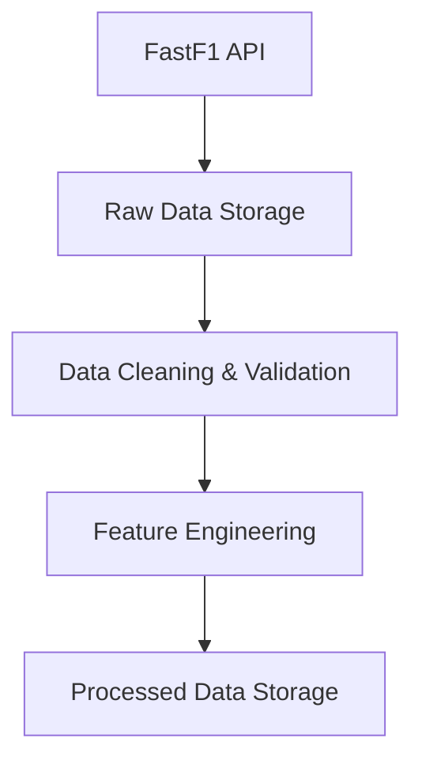

# Phase 1: Data Pipeline & Engineering

## Overview

The data pipeline is the backbone of the F1-ML project. It ensures that data from the FastF1 API is reliably extracted, stored, and transformed for downstream machine learning tasks.

## Key Steps

- **Data Extraction:** Use FastF1 to fetch race, lap, and telemetry data.
- **Storage:** Save raw and processed data in a structured, versioned format (e.g., CSV, SQLite).
- **Preprocessing:** Clean, normalize, and engineer features for modeling.

## Data Flow Diagram

## Data Quality & Error Handling

- Validate data types, ranges, and completeness on extraction
- Handle missing or anomalous values with imputation or removal
- Log data issues for traceability and debugging
- Use try/except blocks and custom error classes for robust pipeline execution

## Principles

- **Reproducibility:** All steps are controlled by configuration files and random seeds.
- **Modularity:** Each pipeline step is a reusable, testable component.
- **Logging:** Comprehensive logging for traceability and debugging.

## Outcome

A robust, extensible pipeline that forms the foundation for all subsequent phases.
