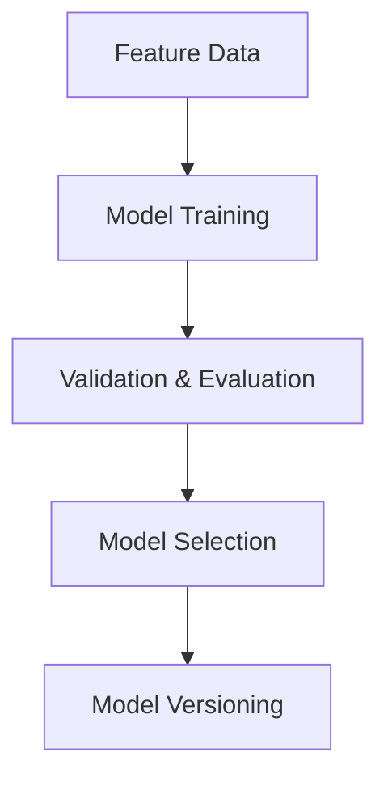

# Phase 3: Modeling & Training Patterns

## Overview

This phase focuses on building, training, and evaluating predictive models using engineered features.

## Key Steps

- **Problem Framing:** Define the prediction task (e.g., race position, lap time).
- **Model Selection:** Start simple (regression, classification), then explore ensembles and advanced models.
- **Training Loop:** Implement robust, configurable training with validation and checkpoints.
- **Evaluation:** Use appropriate metrics and cross-validation.
- **Overfitting Control:** Apply regularization, early stopping, and model selection.

## Candidate Models

- Linear Regression, Logistic Regression
- Random Forest, Gradient Boosting (XGBoost, LightGBM)
- Neural Networks (for advanced use cases)
- Ensemble methods (stacking, bagging)

## Experiment Tracking

- Log parameters, metrics, and artifacts for each run
- Use tools like MLflow or Weights & Biases for systematic tracking

## Workflow Diagram

## Principles

- **Reproducibility:** Fixed random seeds and documented splits.
- **Responsibility:** Transparent reporting and error analysis.
- **Configurability:** All hyperparameters and settings in config files.

## Outcome

Reliable, explainable models ready for deployment and further analysis.
