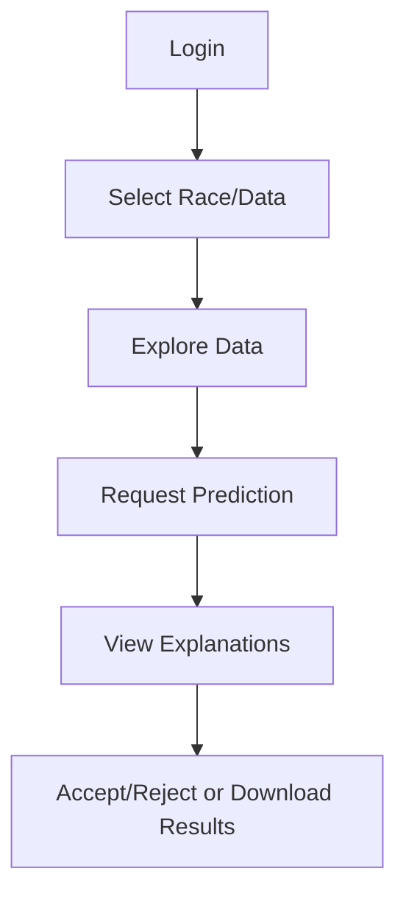

# Phase 4: Serving & Dashboard

## Overview

This phase delivers the AI system to users through an interactive web dashboard, making predictions accessible and understandable.

## Key Steps

- **Flask App:** Build a user-friendly dashboard for data exploration and predictions.
- **User Experience:** Prioritize clarity, transparency, and control (e.g., 'How it works' and 'Accept' buttons).
- **Batch & Windowed Inference:** Support both single and batch predictions, as well as sliding window forecasts.
- **Explainability:** Integrate model explanations (e.g., feature importances, SHAP values).

## API Endpoints
- `/predict`: Get predictions for user input or uploaded data
- `/explain`: Retrieve model explanations for predictions
- `/data`: Access processed data for exploration

## User Roles
- **Viewer:** Explore data and predictions
- **Contributor:** Upload data, suggest features, or run experiments
- **Admin:** Manage models, monitor system, and review logs

## User Journey Diagram

## Principles

- **Transparency:** Users can understand and control the model's behavior.
- **Accessibility:** Intuitive UI/UX for all users.

## Outcome

A robust, interactive interface that bridges the gap between complex models and real-world users.
