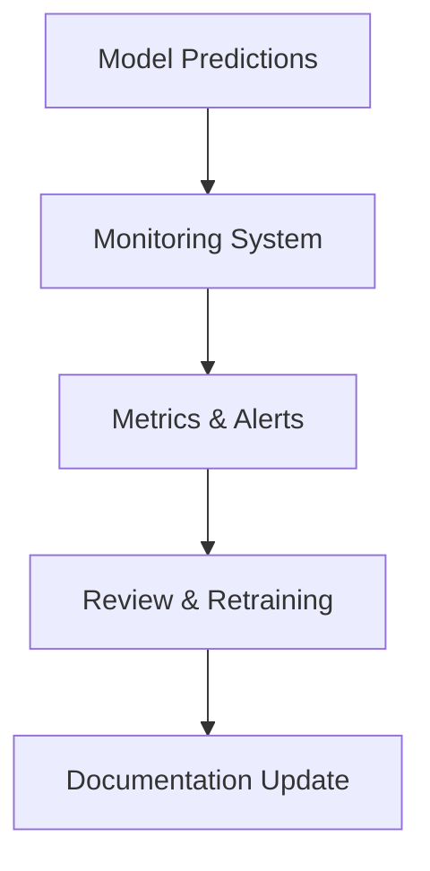

# Phase 5: Monitoring, Explainability & Fairness

## Overview

Ensuring the AI system remains robust, fair, and explainable after deployment is critical for responsible AI.

## Key Steps

- **Monitoring:** Track predictions, errors, and data drift over time.
- **Explainability:** Use tools like SHAP or LIME to explain model decisions.
- **Fairness:** Analyze and mitigate biases (e.g., by driver, team, or season).
- **Documentation:** Maintain clear, up-to-date documentation for all components.

## Metrics to Monitor
- Prediction accuracy, precision, recall, F1-score
- Data drift and feature distribution changes
- Model latency and uptime
- Fairness metrics (e.g., group-wise performance)

## Explainability Integration
- Generate SHAP/LIME explanations for each prediction
- Display explanations in the dashboard
- Log explanations for auditability

## Continuous Improvement
- Regularly review monitoring logs and user feedback
- Retrain or update models as needed
- Update documentation and blueprints with lessons learned

## Monitoring Workflow Diagram

## Principles

- **Responsibility:** Proactively address explainability and fairness.
- **Continuous Improvement:** Use monitoring insights to refine models and processes.

## Outcome

A trustworthy, transparent AI system that meets high standards of responsibility and reliability.
