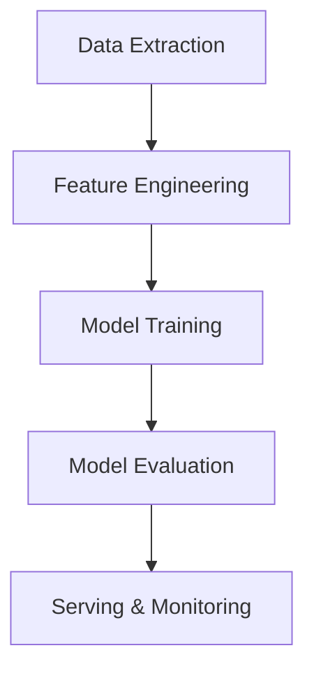

# Design Patterns in ApexAgent

## ML Engineering Patterns

- **Modular Pipeline:** Each step (data extraction, feature engineering, modeling) is a separate, reusable module.
- **Config-Driven Workflow:** Pipeline behavior is controlled by configuration files for reproducibility and flexibility.
- **Feature Store:** Centralized management of features for reuse and versioning.
- **Experiment Tracking:** Systematic logging of experiments, parameters, and results.
- **Model Versioning:** Save and track models with metadata for traceability.
- **Batch Processing:** Efficiently handle multiple data points or predictions at once.

## Software Design Patterns

- **Factory Pattern:** Used for instantiating models or pipeline components based on configuration.
- **Observer Pattern:** For monitoring and logging events during pipeline execution.
- **Strategy Pattern:** Swap out feature engineering or modeling strategies without changing the pipeline structure.
- **Adapter Pattern:** Integrate external data sources (e.g., FastF1) with internal data structures.

## Example: Modular Pipeline

These patterns ensure the project is robust, extensible, and easy to maintain.
