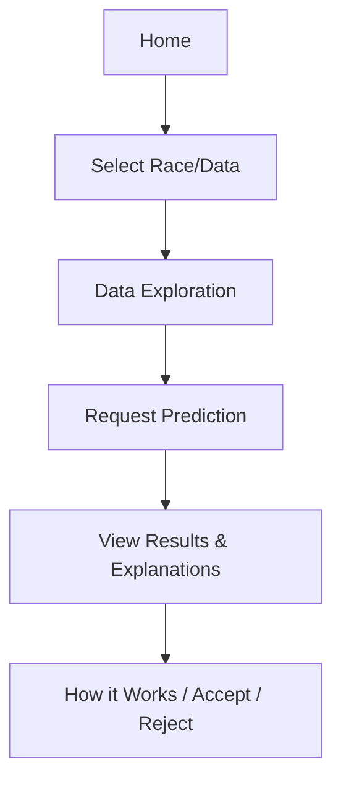

# UI/UX Principles for ApexAgent Dashboard

## Principles

- **Clarity:** Information and controls are easy to find and understand.
- **Transparency:** Users can see how predictions are made and what data is used.
- **Control:** Users can accept, reject, or request explanations for predictions.
- **Accessibility:** The dashboard is usable by people with diverse needs.

## User Journey

1. User selects a race and data to analyze.
2. User explores data visualizations and summary stats.
3. User requests predictions (single or batch).
4. User reviews predictions and explanations.
5. User can view 'How it works' and accept or reject model suggestions.

## Wireframe (Mermaid)

## Accessibility

- Use clear labels, high-contrast colors, and keyboard navigation.
- Provide alt text for images and visualizations.
